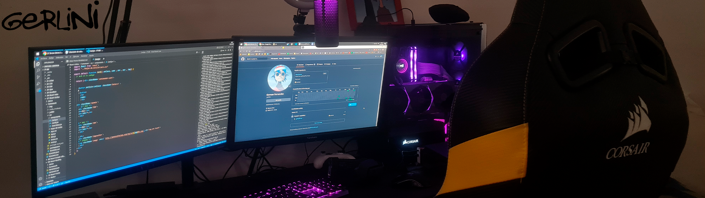

<h1 align="center">Hola , soy ger </h1>

En el año 2022 inicie mi recorrido en el ámbito de la programación, disfruto de adquirir conocimientos nuevos y aplicarlos en mis proyectos cotidianamente.

 La motivación que más me impulsa es aprender tecnologías innovadoras y aplicarlas diariamente para superar mis metas.
 
 

 

#  **Skills**💻

<table align="center">
  <tr>
    <td align="center" width="100">
      
       HTML5
    </td>
    <td align="center" width="100">
      
       CSS3
    </td>
    <td align="center" width="100">
      
       JavaScript
    </td>
    <td align="center" width="100">
      
       PostgreSQL
    </td>

  </tr>
    <td align="center" width="100">
      
       React
    </td>
    <td align="center" width="100">
      
       Redux
    </td>
    </td>
    <td align="center" width="100">
      
       Node.js
    </td>
    <td align="center" width="100"> 
      
       Express.js
    </td>
    
  </tr>
</table>

## Github Stats  
<table><tr><td valign="top" width="50%"  >

</td><td valign="top" width="50%" >

</td></tr></table>  

##  **Contacto** 📩

  
   

Estoy actualmente en busqueda de mi primer empleo en el area IT.

 
Proyectos Deployados:
 
https://pf-techbunny-lake.vercel.app

 

  
<!--
**gerlini/gerlini** is a ✨ _special_ ✨ repository because its `README.md` (this file) appears on your GitHub profile.

Here are some ideas to get you started:

- 🔭 I’m currently working on ...
- 🌱 I’m currently learning ...
- 👯 I’m looking to collaborate on ...
- 🤔 I’m looking for help with ...
- 💬 Ask me about ...
- 📫 How to reach me: ...
- 😄 Pronouns: ...
- ⚡ Fun fact: ...
-->
